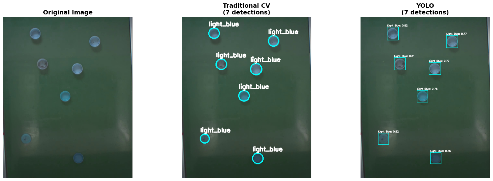

# bsort - Bottle Cap Detection and Classification

A machine learning tool for detecting and classifying bottle caps into three categories (dark blue, light blue, and others) with a target inference speed of 10ms.

## Table of Contents

- [Overview](#overview)
- [Approaches](#approaches)
- [Installation](#installation)
- [Quick Start](#quick-start)
- [Dataset](#dataset)
- [Training a Model](#training-a-model)
- [CLI Commands](#cli-commands)
- [Configuration](#configuration)
- [Results](#results)
- [Performance Benchmarks](#performance-benchmarks)
- [Project Structure](#project-structure)
- [Testing](#testing)
- [Docker Support](#docker-support)
- [Approach Details](#approach-details)
- [Troubleshooting](#troubleshooting)
- [Future Improvements](#future-improvements)

## Overview

### Problem Statement

Detect and classify bottle caps into three categories with 10ms inference speed target:
- **Dark Blue**: Darker blue bottle caps
- **Light Blue**: Lighter blue bottle caps
- **Others**: Non-blue or other colored caps

### Solution

This project implements two complementary approaches to solve the bottle cap detection problem:

1. **Deep Learning (YOLO11n)**: High accuracy and robustness to varying conditions
2. **Traditional CV (Hough Circle + HSV)**: Fast inference and interpretability

### Key Features

- **CLI tool** with 6 commands for complete ML workflow
- **ONNX export** for optimized inference
- **Comprehensive data augmentation** pipeline
- **Weights & Biases integration** for experiment tracking
- **Dual approach** for flexibility between speed and accuracy

## Approaches

### Comparison

| Aspect | Traditional CV | YOLO (Deep Learning) |
|--------|---------------|----------------------|
| **Accuracy** | High (mAP: 0.956) | High (mAP: 0.916) |
| **Speed** | Very Fast (~8ms) | Moderate (~58ms) |
| **Training** | Not required | Required |
| **Interpretability** | High | Low (black box) |
| **Robustness** | Moderate | High |
| **Use Case** | Controlled environment, prototyping | Production, varying conditions |

<!-- Image placeholder: Side-by-side comparison of detection results -->
<!-- TODO: Add comparison image showing both approaches on the same image -->


### When to Use Each Approach

**Use Traditional CV when:**
- ✓ Quick prototyping without training data
- ✓ Controlled environment with consistent lighting
- ✓ Speed is critical (meets 10ms target)
- ✓ Need interpretable results
- ✓ Limited computational resources

**Use YOLO when:**
- ✓ Production systems requiring high accuracy
- ✓ Varying lighting, backgrounds, or camera angles
- ✓ Labeled training data is available
- ✓ GPU resources available
- ✓ Robustness to occlusions and deformations

## Installation

### Prerequisites

- Python 3.8 or higher
- (Optional) CUDA-capable GPU for training

### Installation Steps

**Clone the repository:**
```bash
git clone <repository-url>
cd bsort
```

**Install dependencies:**
```bash
# Install in development mode
pip install -e .

# Or install from requirements.txt
pip install -r requirements.txt
```

### Docker Installation

For containerized deployment, see [DOCKER.md](DOCKER.md).

Quick start with Docker:
```bash
docker build -t bsort:latest .
docker run -v $(pwd)/sample:/data/sample bsort:latest --help
```

## Quick Start

### Validate Your Data

```bash
bsort sanity_check ./sample --visualize
```

### Run Inference

**Traditional CV (fastest - ~8ms):**
```bash
bsort infer-houghcircle --config settings.yaml --image sample/val/images/raw-250110_dc_s001_b4_2.jpg --output result.jpg
```

**YOLO (most accurate):**
```bash
bsort infer --config settings.yaml --image sample/val/images/raw-250110_dc_s001_b4_2.jpg --output result.jpg
```

## Dataset

### Structure

```
sample/
├── train/
│   ├── images/     # Training images (.jpg)
│   └── labels/     # YOLO format labels (.txt)
└── val/
    ├── images/     # Validation images (.jpg)
    └── labels/     # Validation labels (.txt)
```

### Label Format

**YOLO format** (one `.txt` file per image):
```
class_id x_center y_center width height
```

All coordinates are normalized to [0, 1] range.

**Class IDs:**
- `0`: Dark Blue
- `1`: Light Blue
- `2`: Others

**Example:**
```
1 0.5234 0.3421 0.0823 0.0912
1 0.6891 0.4532 0.0789 0.0856
```

### Dataset Characteristics

- **Size**: 12 images in validation set
- **Content**: Multiple bottle caps per image (typically same color)
- **Environment**: Controlled background and lighting
- **Note**: Small dataset size - data augmentation highly recommended for training

## Training a Model

### Step 1: Augment Your Data (Recommended)

Generate augmented training data to improve model robustness:

```bash
bsort augment --input-dir ./sample/train/images --config settings.yaml --num-augmentations 10
```

This applies geometric transformations (rotation, flips, scaling), blur, noise, and perspective distortions while automatically adjusting bounding box annotations.

### Step 2: Configure settings.yaml

Key parameters to adjust:

```yaml
training:
  epochs: 100           # Number of training epochs
  imgsz: 224           # Image size (224x224)
  batch: 16            # Batch size
  device: "cuda"       # Use "cpu" if no GPU available
  patience: 10         # Early stopping patience

# Enable W&B logging (optional)
wandb:
  enabled: true
  project: "bsort-training"
```

See `settings.yaml` for complete configuration options.

### Step 3: Train

```bash
bsort train --config settings.yaml
```

Training artifacts are saved to `run_bsort/train/`:
- `weights/best.pt` - Best model checkpoint
- `weights/last.pt` - Latest checkpoint
- Training plots and metrics

### Step 4: Export to ONNX

Convert the trained model for optimized inference:

```bash
bsort export --model run_bsort/train/weights/best.pt --output best.onnx --imgsz 224
```

### Training Configuration Details

- **Model**: YOLO11n (nano variant - lightweight and fast)
- **Input Size**: 224×224 pixels (optimized for speed)
- **Pre-trained Weights**: COCO dataset
- **Optimizer**: AdamW with adaptive learning rate
- **Early Stopping**: Patience of 10 epochs
- **Augmentations**:
  - Mosaic (1.0) - multi-object learning
  - MixUp (0.3) - prevent class bias
  - Rotation (±15°)
  - Flips (horizontal: 0.5, vertical: 0.5)
  - Translation (±10%)
  - Scale (0.5 gain)

## CLI Commands

### `bsort train`

Train a YOLO model using configuration from YAML file.

```bash
bsort train --config settings.yaml
```

**Options:**
- `--config, -c`: Path to YAML configuration file (required)

### `bsort export`

Export trained YOLO model to ONNX format for optimized inference.

```bash
bsort export --model run_bsort/train/weights/best.pt --output best.onnx
```

**Options:**
- `--model, -m`: Path to trained YOLO model (.pt file) (required)
- `--output, -o`: Output path for ONNX model (optional)
- `--imgsz`: Input image size (default: 224)
- `--opset`: ONNX opset version (default: 12)
- `--validate/--no-validate`: Validate ONNX model after export (default: true)

### `bsort infer`

Run YOLO-based inference on an image.

```bash
bsort infer --config settings.yaml --image test.jpg --output result.jpg
```

**Options:**
- `--config, -c`: Path to YAML configuration file (required)
- `--image, -i`: Path to input image file (required)
- `--output, -o`: Output path for annotated image (optional)

### `bsort infer-houghcircle`

Run traditional CV inference using Hough Circle Transform and HSV analysis.

```bash
bsort infer-houghcircle --config settings.yaml --image test.jpg --output result.jpg
```

**Options:**
- `--config, -c`: Path to YAML configuration file (required)
- `--image, -i`: Path to input image file (required)
- `--output, -o`: Output path for annotated image (optional)

### `bsort sanity_check`

Validate dataset integrity and optionally visualize detections.

```bash
bsort sanity_check ./sample --visualize --min-samples 20
```

**Options:**
- `sample_dir`: Path to sample directory (default: `./sample`)
- `--visualize, -v`: Generate visualizations after validation
- `--min-samples, -n`: Minimum number of samples to visualize (default: 20)

**Validation checks:**
- File pairing (each .jpg has matching .txt)
- Naming convention validation
- Data format and completeness
- Value range validation

### `bsort augment`

Generate augmented versions of dataset images.

```bash
bsort augment --input-dir ./sample/train/images --config settings.yaml --num-augmentations 10
```

**Options:**
- `--input-dir, -i`: Directory containing images to augment (required)
- `--config, -c`: Path to YAML configuration file (required)
- `--num-augmentations, -n`: Number of augmented versions per image (default: 7)

**Augmentations applied:**
- Rotation (up to 30 degrees)
- Horizontal and vertical flips
- Scale and translation (affine transforms)
- Gaussian blur
- Gaussian noise
- Perspective transforms

## Configuration

The `settings.yaml` file controls all aspects of the bsort pipeline.

### Key Configuration Sections

**Model:**
```yaml
model:
  type: "yolo11n.pt"  # Model architecture
```

**Dataset:**
```yaml
data:
  yaml_path: "sample/data.yaml"  # Path to YOLO dataset config
```

**Training:**
```yaml
training:
  epochs: 100
  imgsz: 224
  batch: 16
  device: "cuda"
  patience: 10
  augmentation:
    # Built-in YOLO augmentations
    mosaic: 1.0
    mixup: 0.3
    # ... see settings.yaml for all options
```

**Inference:**
```yaml
inference:
  model_path: "run_bsort/train/weights/best.onnx"
  confidence_threshold: 0.25
  iou_threshold: 0.45
  imgsz: 224
  class_names:
    - "Dark Blue"
    - "Light Blue"
    - "Others"
```

**Weights & Biases:**
```yaml
wandb:
  enabled: true
  project: "bsort-training"
  name: null  # Auto-generated if null
```

See `settings.yaml` for complete configuration options and detailed comments.

## Results

### Performance Comparison

Based on evaluation on 12 validation images:

| Metric | Traditional CV | YOLO |
|--------|---------------|------|
| **mAP@0.5** | **0.956** | 0.916 |
| **Avg Inference Time** | **8.19 ms** | 57.51 ms |
| **FPS** | **122.2** | 17.4 |
| **Light Blue Precision** | 1.000 | 1.000 |
| **Light Blue Recall** | 1.000 | 1.000 |
| **Light Blue F1** | 1.000 | 1.000 |
| **Dark Blue Precision** | 0.938 | 0.773 |
| **Dark Blue Recall** | 0.882 | 1.000 |
| **Dark Blue F1** | 0.909 | 0.872 |
| **Others Precision** | 0.932 | 0.976 |
| **Others Recall** | 0.932 | 0.909 |
| **Others F1** | 0.932 | 0.941 |

### Key Findings

- ✅ **Traditional CV achieves ~8ms inference** - meets the 10ms target
- ✅ **Both approaches achieve >90% accuracy** on validation set
- ✅ **Perfect light blue detection** (F1=1.000) for both approaches
- 🔍 **Traditional CV has higher mAP** (0.956 vs 0.916) on this controlled dataset
- 🔍 **YOLO has better dark blue recall** (1.000 vs 0.882) but lower precision
- ⚡ **Traditional CV is 7x faster** than YOLO (8.19ms vs 57.51ms)

**Trade-off:** Traditional CV excels in this controlled environment, but YOLO would likely perform better with:
- Varying lighting conditions
- Different backgrounds
- Occlusions or deformations
- Multiple cap colors in a single image

## Performance Benchmarks

Detailed performance metrics on validation dataset.

### Hardware Configuration

<!-- TODO: Fill in based on your system -->
- **CPU**: AMD Ryzen 7 4800HS
- **GPU**: NVIDIA GeForce GTX 1650 Ti

### Inference Speed Breakdown

**Traditional CV Pipeline (~8.19ms total):**
- Preprocessing (gamma, CLAHE, blur): ~2-3 ms
- Hough Circle detection: ~4-5 ms
- HSV color classification: ~1-2 ms

**YOLO Pipeline (~57.51ms total):**
- Preprocessing (resize, normalize): ~2-3 ms
- ONNX model inference: ~50-52 ms
- Post-processing (NMS): ~3-5 ms

### Memory Usage

- **Traditional CV**: ~50-100 MB (minimal overhead)
- **YOLO (ONNX runtime)**: ~200-300 MB

### Model Size

- **YOLO11n (.pt)**: ~5.6 MB
- **YOLO11n (.onnx)**: ~11.2 MB

## Project Structure

```
bsort/
├── bsort/                      # Main package
│   ├── __init__.py            # Package initialization
│   ├── cli.py                 # CLI interface (Typer)
│   ├── config.py              # Configuration loader
│   ├── train.py               # YOLO training pipeline
│   ├── export.py              # ONNX export utilities
│   ├── infer.py               # YOLO inference pipeline
│   ├── infer_houghcircle.py   # Traditional CV inference
│   ├── augment.py             # Data augmentation pipeline
│   └── sanity_check.py        # Dataset validation
├── tests/                      # Unit tests
│   ├── conftest.py            # Shared test fixtures
│   ├── test_config.py         # Configuration tests
│   ├── test_infer.py          # Inference pipeline tests
│   └── test_export.py         # ONNX export tests
├── sample/                     # Sample dataset
│   ├── train/
│   │   ├── images/            # Training images
│   │   └── labels/            # Training labels (YOLO format)
│   └── val/
│       ├── images/            # Validation images
│       └── labels/            # Validation labels
├── run_bsort/                 # Training outputs (created after training)
│   └── train/
│       └── weights/           # Model checkpoints
├── settings.yaml              # Configuration file
├── bsort.ipynb               # Research notebook with detailed analysis
├── pyproject.toml            # Package metadata and dependencies
├── DOCKER.md                 # Docker setup guide
└── README.md                 # This file
```

## Testing

The project includes comprehensive unit tests for core functionality with 22% overall coverage.

### Running Tests

**Install test dependencies:**
```bash
pip install -e ".[dev]"
```

**Run all tests:**
```bash
pytest
```

**Run with coverage report:**
```bash
pytest --cov=bsort --cov-report=term-missing
```

**Run specific test file:**
```bash
pytest tests/test_infer.py -v
```

### Test Coverage

| Module | Coverage | Tests |
|--------|----------|-------|
| `export.py` | 100% ✅ | 10 tests |
| `config.py` | 100% ✅ | 5 tests |
| `infer.py` | 73% | 15 tests |

**Key test areas:**
- ✅ Image preprocessing and normalization
- ✅ Non-Maximum Suppression (NMS) algorithm
- ✅ ONNX model export and validation
- ✅ Configuration loading and error handling
- ✅ Bounding box transformations and clipping

### Test Commands

```bash
# Run tests matching a pattern
pytest -k "export" -v

# Generate HTML coverage report
pytest --cov=bsort --cov-report=html
# Open htmlcov/index.html in browser

# Run tests with detailed output
pytest -v -s
```

## Docker Support

For containerized deployment with Docker, see the detailed guide in [DOCKER.md](DOCKER.md).

### Quick Docker Start

**Build the image:**
```bash
docker build -t bsort:latest .
```

**Run sanity check:**
```bash
docker run -v $(pwd)/sample:/data/sample bsort:latest sanity_check /data/sample
```

**Run inference:**
```bash
docker run -v $(pwd)/sample:/data/sample -v $(pwd)/outputs:/outputs \
  bsort:latest infer-houghcircle --config /data/sample/config.yaml \
  --image /data/sample/test.jpg --output /outputs/result.jpg
```

## Approach Details

### YOLO Approach

**Architecture:**
- **Model**: YOLO11n (nano variant)
- **Pre-trained**: COCO dataset weights
- **Input**: 224×224 RGB images
- **Output**: Bounding boxes (x, y, w, h) + class probabilities

**Pipeline:**

1. **Preprocessing:**
   - Resize to 224×224
   - Normalize to [0, 1]
   - Convert HWC → CHW format

2. **Inference:**
   - ONNX runtime for CPU-optimized inference
   - Single forward pass
   - Output shape: (1, 7, N) where N is number of detections

3. **Post-processing:**
   - Convert xywh → xyxy format
   - Scale boxes to original image size
   - Apply Non-Maximum Suppression (NMS)
   - Filter by confidence threshold (default: 0.25)

**Advantages:**
- Learned features adapt to data
- Robust to lighting variations
- Handles occlusions well

**Disadvantages:**
- Requires labeled training data
- Slower inference (~58ms)
- Less interpretable (black box)

### Traditional CV Approach

**Pipeline:**

1. **Preprocessing:**
   - **Resize**: 0.4x scale for faster processing
   - **Gamma correction** (γ=0.5): Brighten image
   - **CLAHE**: Enhance local contrast
     - clipLimit=2.0, tileGridSize=(4,4)
   - **Gaussian blur**: Reduce noise
     - kernel=(7,7), sigma=1.5

2. **Circle Detection:**
   - **Hough Circle Transform** with optimized parameters:
     - dp=1.2 (accumulator resolution)
     - minDist=25 (minimum distance between centers)
     - param1=35 (Canny edge threshold)
     - param2=25 (accumulator threshold)
     - minRadius=8, maxRadius=16

3. **Color Classification:**
   - Extract pixels within detected circles
   - Convert to HSV color space
   - Calculate mean Hue (H) value
   - Apply classification rules:
     - **Dark Blue**: H ∈ [102.5, 130]
     - **Light Blue**: H ∈ [85, 102.5]
     - **Others**: H < 85 or H > 130

**Advantages:**
- No training required
- Very fast inference (~8ms)
- Interpretable parameters
- Works well in controlled environments

**Disadvantages:**
- Sensitive to parameter tuning
- Struggles with lighting variations
- Fixed rules don't generalize well
- May miss deformed or occluded caps

## Troubleshooting

### Common Issues and Solutions

#### Issue: ModuleNotFoundError for bsort

```bash
# Solution: Install in development mode
pip install -e .
```

#### Issue: CUDA out of memory during training

```yaml
# Solution 1: Reduce batch size in settings.yaml
training:
  batch: 8  # or smaller

# Solution 2: Use CPU instead
training:
  device: "cpu"
```

#### Issue: Poor detection accuracy

**For YOLO:**
- Check if model is trained on similar data
- Lower confidence threshold: `confidence_threshold: 0.15` in settings.yaml
- Ensure preprocessing matches training pipeline
- Try training with more augmented data

**For Traditional CV:**
- Adjust Hough Circle parameters in `bsort/infer_houghcircle.py`:
  - Lower `param2` (20-30) for more detections
  - Adjust `minRadius`/`maxRadius` based on actual cap sizes
- Tune HSV thresholds if color ranges are different

#### Issue: Slow inference on CPU

**Solutions:**
- Use Traditional CV approach instead of YOLO (7x faster)
- Ensure ONNX model is being used (not .pt file)
- Reduce image size if acceptable
- Consider model quantization (INT8) for 2-4x speedup

#### Issue: HoughCircle not detecting circles

**Check:**
- Preprocessing parameters (gamma, CLAHE settings)
- Image resize factor (default 0.4x)
- Circle radius range (minRadius/maxRadius)

**Adjust parameters:**
```python
# In bsort/infer_houghcircle.py
circles = cv2.HoughCircles(
    gray_blur,
    cv2.HOUGH_GRADIENT,
    dp=1.2,
    minDist=25,
    param1=35,      # Try 30-40
    param2=25,      # Try 20-30 (lower = more sensitive)
    minRadius=8,    # Adjust based on cap size
    maxRadius=16
)
```

## Future Improvements

### Dataset

- **Improve quantity**: Current dataset is too small to do proper training
- **Improve variety**: Objects in each image are too homogeneous - each image contains the same color variety which can cause model bias to cluster the same type in single image
- **Add foreign objects and background variety**: Optional, only if deployment environment is not controlled

### Deep Learning

- **Try different models**: Such as NanoDet for faster inference

### Traditional Computer Vision

- **Try different methods**: Such as background extraction with MOG2 to detect bottle caps since the environment is controlled

---

For detailed technical analysis, training metrics, and evaluation results, refer to `bsort.ipynb`.
